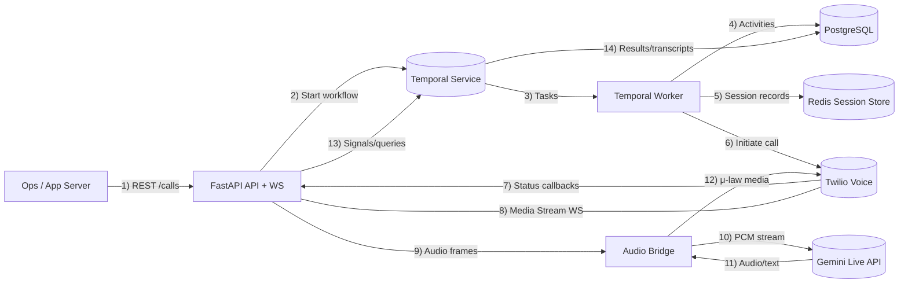
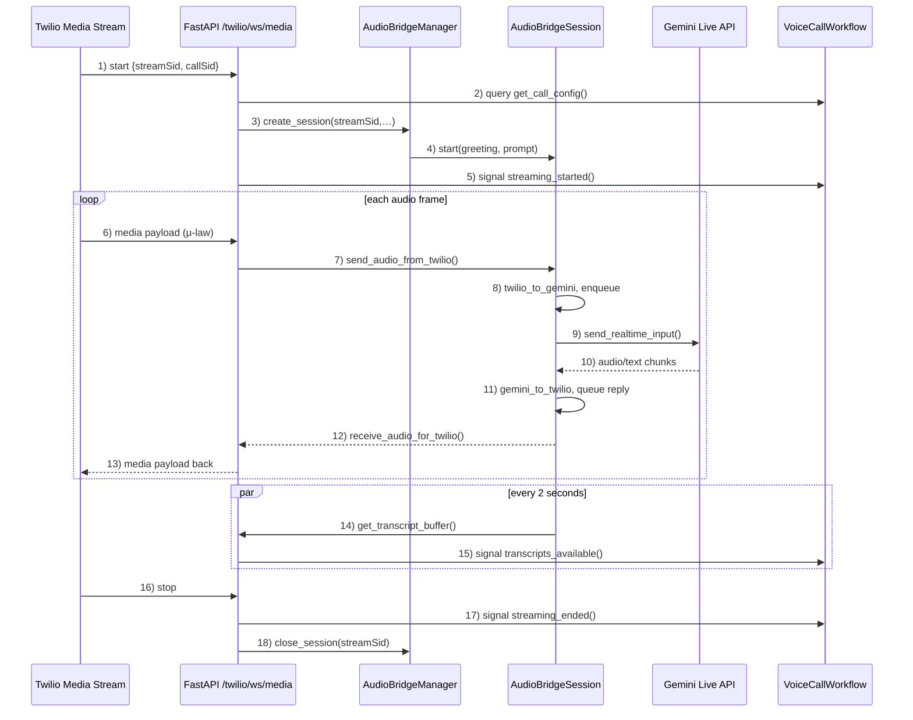
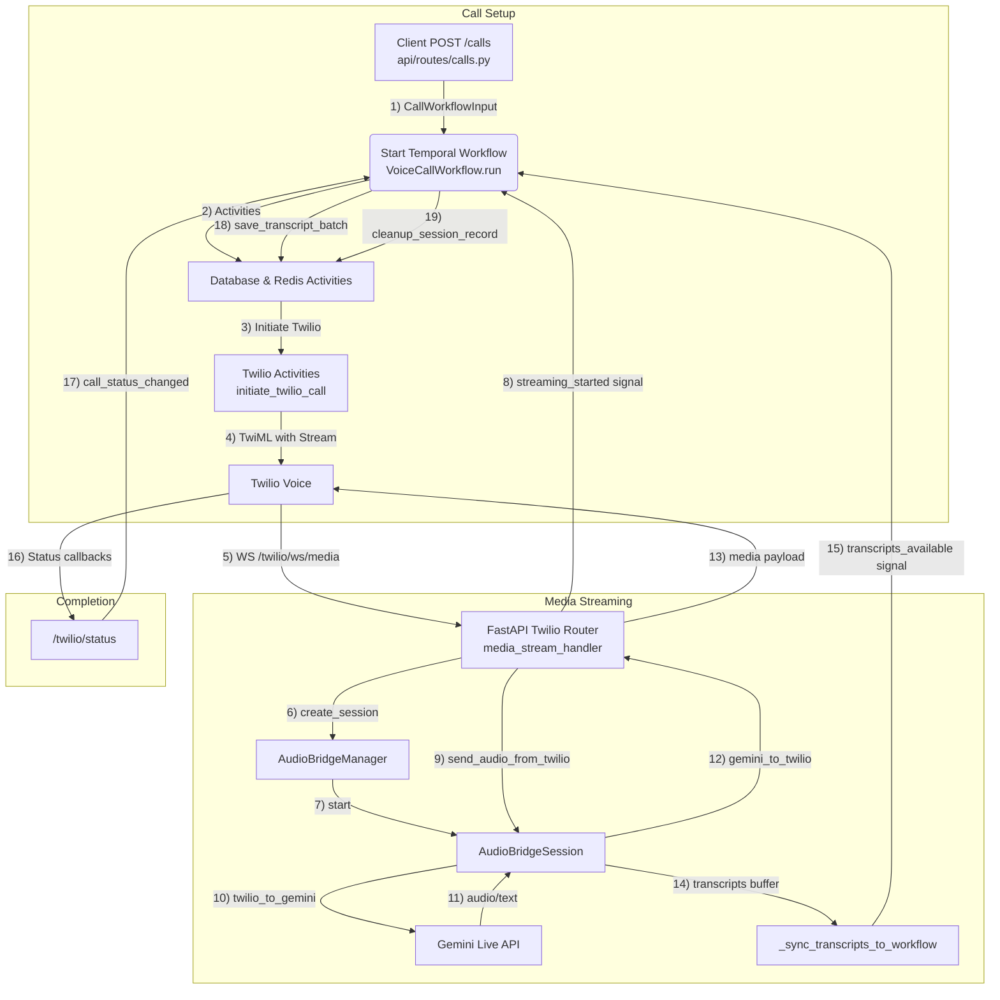
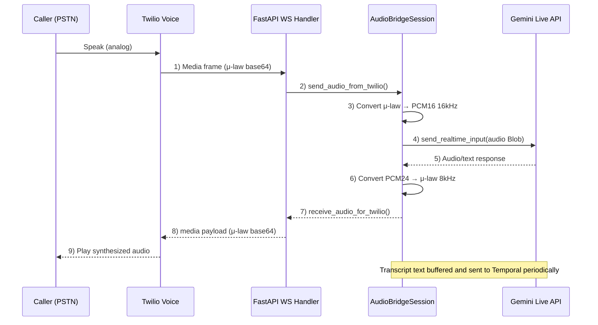

# Architecture Diagrams

## System Overview

```mermaid
flowchart LR
    Client[Ops / App Server]
    FastAPI[FastAPI API + WS]
    Temporal[(Temporal Service)]
    Worker[Temporal Worker]
    Postgres[(PostgreSQL)]
    Redis[(Redis Session Store)]
    Twilio[(Twilio Voice)]
    AudioBridge[Audio Bridge]
    Gemini[(Gemini Live API)]

    Client -- "1) REST /calls" --> FastAPI
    FastAPI -- "2) Start workflow" --> Temporal
    Temporal -- "3) Tasks" --> Worker
    Worker -- "4) Activities" --> Postgres
    Worker -- "5) Session records" --> Redis
    Worker -- "6) Initiate call" --> Twilio
    Twilio -- "7) Status callbacks" --> FastAPI
    Twilio -- "8) Media Stream WS" --- FastAPI
    FastAPI -- "9) Audio frames" --> AudioBridge
    AudioBridge -- "10) PCM stream" --> Gemini
    Gemini -- "11) Audio/text" --> AudioBridge
    AudioBridge -- "12) μ-law media" --> Twilio
    FastAPI -- "13) Signals/queries" --> Temporal
    Temporal -- "14) Results/transcripts" --> Postgres
```

## Audio Bridge Sequence

```mermaid
sequenceDiagram
    participant Twilio as Twilio Media Stream
    participant API as FastAPI /twilio/ws/media
    participant BridgeMgr as AudioBridgeManager
    participant Bridge as AudioBridgeSession
    participant Gemini as Gemini Live API
    participant Workflow as VoiceCallWorkflow

    Twilio->>API: 1) start {streamSid, callSid}
    API->>Workflow: 2) query get_call_config()
    API->>BridgeMgr: 3) create_session(streamSid,…)
    BridgeMgr->>Bridge: 4) start(greeting, prompt)
    API->>Workflow: 5) signal streaming_started()

    loop each audio frame
        Twilio->>API: 6) media payload (μ-law)
        API->>Bridge: 7) send_audio_from_twilio()
        Bridge->>Bridge: 8) twilio_to_gemini, enqueue
        Bridge->>Gemini: 9) send_realtime_input()
        Gemini-->>Bridge: 10) audio/text chunks
        Bridge->>Bridge: 11) gemini_to_twilio, queue reply
        Bridge-->>API: 12) receive_audio_for_twilio()
        API-->>Twilio: 13) media payload back
    end

    par every 2 seconds
        Bridge->>API: 14) get_transcript_buffer()
        API->>Workflow: 15) signal transcripts_available()
    end

    Twilio->>API: 16) stop
    API->>Workflow: 17) signal streaming_ended()
    API->>BridgeMgr: 18) close_session(streamSid)
```

## Code Flow Paths

```mermaid
flowchart TD
    subgraph Call Setup
        A[Client POST /calls\napi/routes/calls.py] -->|"1) CallWorkflowInput"| B(Start Temporal Workflow\nVoiceCallWorkflow.run)
        B -->|"2) Activities"| C[Database & Redis Activities]
        C -->|"3) Initiate Twilio"| D[Twilio Activities\ninitiate_twilio_call]
        D -->|"4) TwiML with Stream"| E[Twilio Voice]
    end

    subgraph Media Streaming
        E -->|"5) WS /twilio/ws/media"| F[FastAPI Twilio Router\nmedia_stream_handler]
        F -->|"6) create_session"| G[AudioBridgeManager]
        G -->|"7) start"| H[AudioBridgeSession]
        F -->|"8) streaming_started signal"| B
        F -->|"9) send_audio_from_twilio"| H
        H -->|"10) twilio_to_gemini"| I[Gemini Live API]
        I -->|"11) audio/text"| H
        H -->|"12) gemini_to_twilio"| F
        F -->|"13) media payload"| E
        H -->|"14) transcripts buffer"| J[_sync_transcripts_to_workflow]
        J -->|"15) transcripts_available signal"| B
    end

    subgraph Completion
        E -->|"16) Status callbacks"| F2["/twilio/status"]
        F2 -->|"17) call_status_changed"| B
        B -->|"18) save_transcript_batch"| C
        B -->|"19) cleanup_session_record"| C
    end
```

## Conversation Loop Focus

```mermaid
sequenceDiagram
    participant Caller as Caller (PSTN)
    participant Twilio as Twilio Voice
    participant API as FastAPI WS Handler
    participant Bridge as AudioBridgeSession
    participant Gemini as Gemini Live API

    Caller->>Twilio: Speak (analog)
    Twilio->>API: 1) Media frame (μ-law base64)
    API->>Bridge: 2) send_audio_from_twilio()
    Bridge->>Bridge: 3) Convert μ-law → PCM16 16kHz
    Bridge->>Gemini: 4) send_realtime_input(audio Blob)
    Gemini-->>Bridge: 5) Audio/text response
    Bridge->>Bridge: 6) Convert PCM24 → μ-law 8kHz
    Bridge-->>API: 7) receive_audio_for_twilio()
    API-->>Twilio: 8) media payload (μ-law base64)
    Twilio-->>Caller: 9) Play synthesized audio

    Note over Bridge,Gemini: Transcript text buffered and sent to Temporal periodically
```
